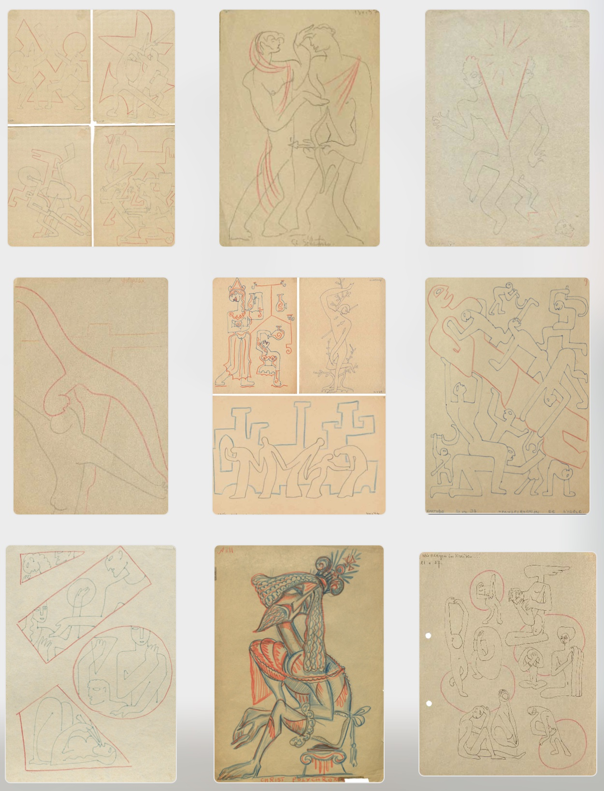

# Eisenstein Drawings

> In blue ink, Eisenstein drew the Battle on the Ice: moments from the fight between the Teutonic Knights and the warriors of Alexander Nevsky. In red pencil, he added abstract geometrical figures, which, however, sometimes clearly recalled horses. But these were not sketches for the film, whether in style or in meaning. They can be defined as ‘graphic formulae’ for the audiovisual combinations in the cinema: the blue standing for the image and the red for the music.

> And each blue figure has its counterpoint of red geometrical lines – that imagined music, which could also be purely visual.

> With separation in time, nothing remains but the wave- like outline of the way the course of events oscillates. And so we have the purely musical part of the process.

> There are as it were two times and two spaces: one of history and the calendar, the other incalculable and musical. Great movements arise out of the spirit of music, and are penetrated by it as they act....

Eisenstein on Paper p. 166/167

